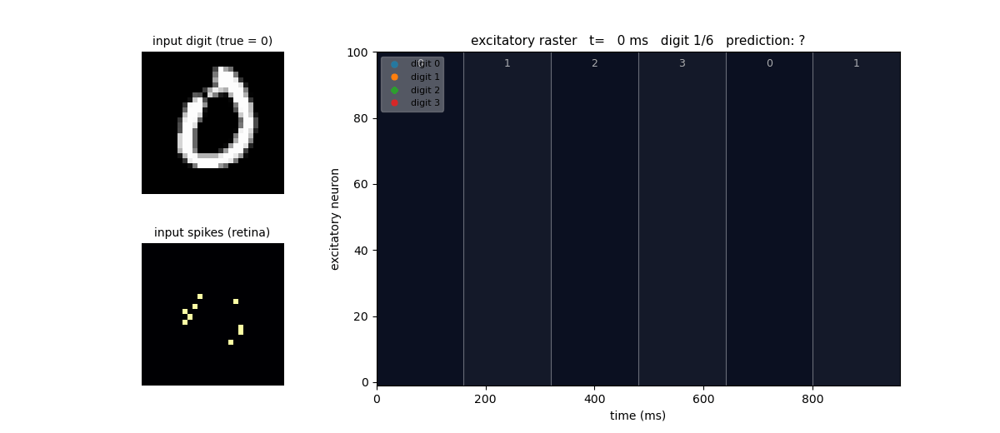
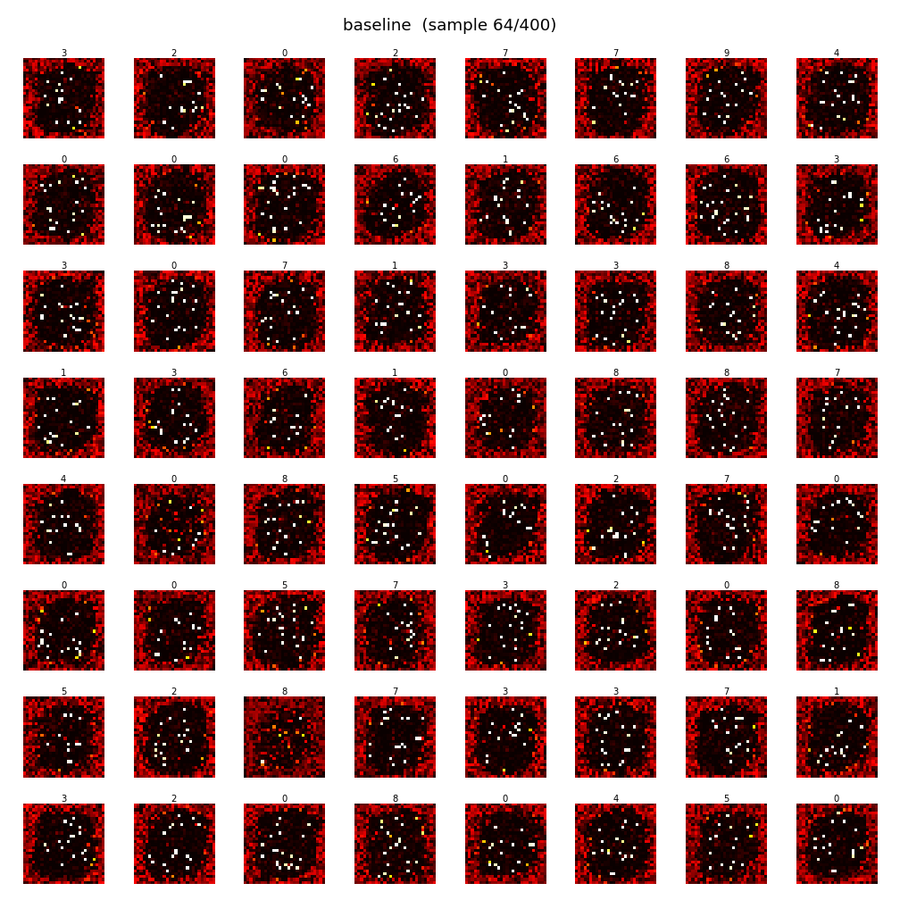
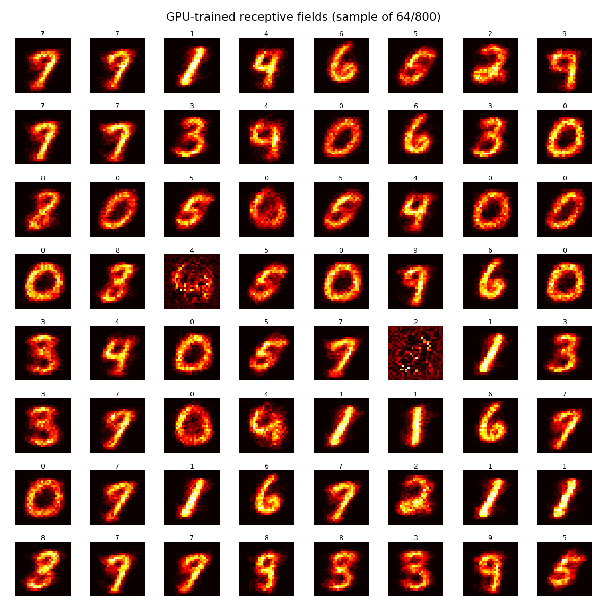
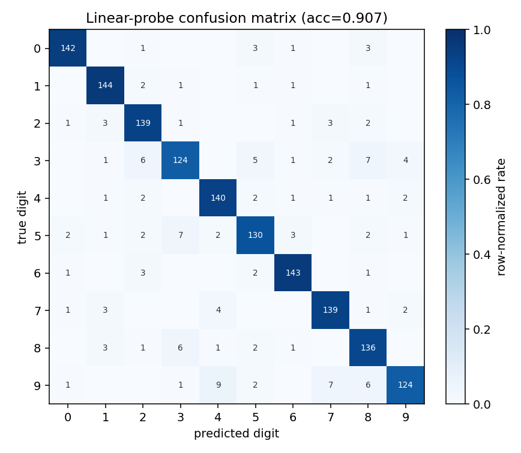

# synthbrain

[](https://github.com/Tharusha101/synthbrain/actions/workflows/tests.yml)
[](LICENSE)
[](pyproject.toml)

**A spiking neural network that learns to read MNIST digits — with no backpropagation, built from scratch in NumPy.**

Real-style neurons (leaky integrate-and-fire) wired randomly, learning purely
from the *timing* of their spikes (STDP). No gradients, no loss function, and
**no labels during training** — the network discovers clean, human-readable
digit templates entirely on its own.

To *measure* what it learned, a supervised **linear probe** (logistic regression
on the frozen spike counts) reaches **~90% MNIST accuracy**. The network's own
fully-unsupervised **native readout** reaches **~60%** (vs. 10% chance). The
SNN's weights are never touched by a gradient — the probe is just a ruler held up
to the learned representation.

<p align="center">
  
</p>

> *The live demo: a Poisson-encoded digit on the left ("retina"), the excitatory
> layer spiking on the right — each neuron coloured by the digit it specialised
> in — and a running prediction underneath. Nothing here was trained with
> backprop; the structure is entirely self-organised.*

---

## Headline result

| | native readout | **linear probe** | chance |
|---|---|---|---|
| best model (seed 0) | 0.595 | **0.911** | 0.10 |
| **5-seed mean ± std** | 0.602 ± 0.013 | **0.900 ± 0.007** | 0.10 |

- **Unsupervised + backprop-free.** Labels are used *only* at readout, never to
  drive learning. The linear probe is logistic regression on **frozen** spike
  counts — the SNN itself never sees a gradient.
- **The representation is genuinely digit-like.** Mean Pearson correlation
  between each neuron's receptive field and its digit's class-mean image
  (`tmpl_match`) is **0.89** — up from **−0.13** at baseline. Zero dead neurons.
- **Robust, not a lucky seed.** Retrained across 5 RNG seeds (weight init,
  Poisson noise, batch order all varied): 0.900 ± 0.007.

> **What the numbers mean — read this before quoting the 90%.**
> - STDP training is **fully unsupervised**; it never sees labels.
> - Labels are used **only at evaluation**, two ways:
>   1. **Native readout** — assign each neuron to the class it fires most for, then
>      vote. This is the unsupervised score: **~60%**.
>   2. **Linear probe** — a *supervised* logistic regression fit on the **frozen**
>      spike counts (the SNN's weights stay fixed): **~90%**.
> - So the **90% headline is the supervised linear probe**, not the SNN
>   classifying at 90% unsupervised. The probe measures how linearly-decodable the
>   learned representation is; it adds one trained layer on top of frozen features.

### Receptive fields: noise → clean digits

What each neuron learned to detect, before and after the two key learning-dynamics fixes:

| baseline (noisy) | final recipe (clean) |
|---|---|
|  |  |
| scattered-pixel detectors, `tmpl_match −0.13` | human-readable strokes, `tmpl_match 0.89`, 0 dead |

### Confusion matrix (linear probe)

<p align="center">
  
</p>

Strong diagonal; 0/1/6 near-perfect. The residual errors are the *classic* shape
confusions any digit classifier makes — 9↔4, 9↔7, 3↔8, 3↔5.

---

## How it works

Architecture follows Diehl & Cook (2015), built from first principles:

```
  28×28 image
      │  Poisson encoding (spike rate ∝ pixel intensity)
      ▼
 ┌─────────────┐   plastic synapses (STDP, L1-normalised)
 │  784 inputs │ ─────────────────────────────────────────┐
 └─────────────┘                                           ▼
                                                  ┌──────────────────┐
                lateral inhibition  ◄────────────►│ 800 excitatory   │
                (winner-take-all)                 │ LIF neurons      │
                                                  │ + adaptive thresh│
                                                  └──────────────────┘
                                                           │
                                              readout (post-hoc, eval only):
                                              native label-assignment  OR
                                              linear probe on spike counts
```

The pieces, each verified in isolation (`scripts/verify_*.py`):

- **LIF neurons** (`lif.py`) — leaky integrate-and-fire with standard constants
  (τ_m = 20 ms, v_thresh = −52 mV). Monotonic F–I curve, rheobase ≈ 13, clean
  refractory reset. Optional per-neuron **adaptive threshold** for homeostasis.
- **Synapses** (`synapses.py`) — exponential-decay current injection, exact
  weight deposit, L1-normalised weight budget per neuron.
- **Poisson encoding** (`encoding.py`) — pixel intensity → spike rate, with
  per-image gain equalisation so thin digits don't drown dense ones.
- **STDP** (`stdp.py`) — pair-based trace rule: pre-before-post potentiates,
  post-before-pre depresses. Reproduces the canonical asymmetric learning window.
- **Network** (`network.py`) — wires it together with lateral inhibition for
  competition. A batched GPU port (`torch_snn.py`) runs the same equations on
  CUDA for fast iteration.

---

## The interesting part: what actually moved the needle

This project's real story is a sequence of **falsified assumptions**. The
"obvious" knobs were mostly wrong, and finding out *why* was the work.

**❌ "Clean templates just need more data."** *Falsified.* A 10× data run
(45,000 presentations) gave **no** accuracy gain and *still* produced noisy
receptive fields. The bottleneck was never data volume — it was the learning
dynamics.

**✅ `a_plus` (LTP strength) is the cleanliness lever.** Doubling it
(0.01 → 0.02) took `tmpl_match` from −0.13 to +0.49 — the first time templates
ever looked like digits. *But* strong potentiation killed ~43% of neurons
(runaway specialisation against a fixed weight budget), and accuracy fell.

**✅ `theta_plus` (threshold homeostasis) cancels the side-effect.** Firing
raises a neuron's *own* threshold, so quiet neurons get a turn. Sweeping it
fixed the dead-neuron problem completely and saturated at **2.0**:

| theta_plus | accuracy | tmpl_match | dead neurons |
|---|---|---|---|
| 0.4 | 0.48 | 0.43 | 21% |
| 1.2 | 0.60 | 0.72 | 1.4% |
| **2.0** | **0.615** | **0.894** | **0.0%** |
| 2.5 | 0.605 | 0.897 | 0.0% (over-regularises) |

**✅ The clean-vs-accurate "trade-off" was a *readout artifact*.** The native
mean-spike-count readout badly undersells *selective* neurons. Swap in a linear
probe and the trade-off **inverts** — the cleanest network is also the most
accurate:

| network (n_exc = 800) | native | **linear probe** | tmpl_match |
|---|---|---|---|
| noisy baseline | 0.709 | 0.875 | −0.12 |
| clean θ = 0.4 | 0.481 | 0.846 | 0.43 |
| **clean θ = 2.0 ★** | 0.615 | **0.905** | **0.894** |

**❌ "A biologically-explicit inhibitory layer should help."** *Falsified.* The
true Diehl & Cook two-population inhibition scored ~8 points *worse* and ran
~1.7× slower at this scale. Lateral inhibition stays the default.

**❌ "More neurons = better."** *Partly falsified.* n_exc = 1600 was *under-trained*
at this data budget (0.872 probe, 13% dead). 800 is the sweet spot.

> The takeaway that surprised me most: a representation can be *good* long before
> your readout can *see* it. The clean network looked worse for weeks — until the
> readout was fixed.

---

## Repository layout

```
synthbrain/
  synthbrain/            # the package (pure-NumPy core)
    lif.py              # LIF neuron layer (+ adaptive threshold)
    synapses.py         # weights + exponential synaptic current
    encoding.py         # Poisson encoding + MNIST loader (offline fallback)
    stdp.py             # pair-based STDP learning rule
    network.py          # full SNN: input → exc, inhibition, readout
    torch_snn.py        # batched GPU port (CUDA) + linear_probe()
  scripts/
    reproduce_tiny.py   # fast offline smoke run (<2 min, proves it works)
    demo_network.py     # 4-class CPU demo: train → label → accuracy
    scaleup_network.py  # 10-class CPU run (NumPy)
    train_gpu.py        # 10-class GPU run with the winning recipe
    finalize_eval.py    # multi-seed robustness + confusion matrix
    sweep_receptive_fields.py  # hyperparameter sweep + cleanliness metrics
    readout_experiment.py      # native vs. linear-probe readout
    animate_network.py  # the live spike-raster GIF
    verify_*.py         # per-component correctness checks (with plots)
  tests/
    test_core.py        # building-block unit tests (LIF, synapses, STDP, encoding)
    test_network.py     # Network readout API + save/load round-trip
    test_torch_snn.py   # TorchSNN forward pass (skipped if torch absent)
  outputs/samples/      # curated figures, GIF, best model, metrics JSON
  pyproject.toml        # installable package + dev / mnist / probe extras
  .github/workflows/    # CI: pytest + ruff on every push and PR
```

The winning configuration is documented in detail in
[`outputs/samples/BEST_TRAINING.md`](outputs/samples/BEST_TRAINING.md), and the
saved model is `outputs/samples/gpu_best_net.npz`.

---

## Install

```bash
# core only (the from-scratch NumPy SNN):
pip install -e .

# everything (GPU port, MNIST loader, linear probe, dev tools):
pip install -e ".[dev,mnist,probe]"
```

## Quickstart

The first commands need **no GPU and no dataset download**:

```bash
# 1. smoke test — every building block passes (seconds):
pytest -q

# 2. tiny end-to-end run — trains a small SNN on offline synthetic digits,
#    prints the spike-count shape + accuracy, writes a receptive-field PNG (<2 min):
python scripts/reproduce_tiny.py

# 3. small MNIST demo — 4 digits on CPU (falls back to synthetic data offline):
python scripts/demo_network.py
```

## Full reproduction

```bash
# Full 10-class CPU run (NumPy, ~3-4 min):
python scripts/scaleup_network.py

# Full winning recipe on GPU — 800 neurons, 36k presentations, ~20 min on an
# RTX 4060 — reproduces the 0.91 linear-probe result:
python scripts/train_gpu.py

# Multi-seed robustness + confusion matrix (the 0.900 ± 0.007 figure):
python scripts/finalize_eval.py
```

> **Windows note:** torchvision's MNIST loader clashes with Anaconda's MKL
> OpenMP. If you hit `OMP: Error #15`, set `KMP_DUPLICATE_LIB_OK=TRUE` for that
> run. The core SNN has no such dependency.

---

## Honest caveats

- **It's not state-of-the-art MNIST** (a tiny CNN with backprop gets ~99%). The
  point isn't the score — it's that a representation good enough for a linear
  probe to reach **~90%** emerged from local, biologically plausible learning
  rules with **no gradient signal at all**.
- **The 90% is a *supervised* linear probe**, not unsupervised classification.
  The probe fits logistic regression on the frozen spike counts; the SNN's
  weights are never updated by it. The fully-unsupervised native readout is
  **~60%**.
- Single-machine scale. Pushing past 800 neurons would need a larger data budget
  than tested here.

---

## Reference

Diehl, P. U., & Cook, M. (2015). *Unsupervised learning of digit recognition
using spike-timing-dependent plasticity.* Frontiers in Computational
Neuroscience. — the architectural blueprint this project rebuilds from scratch.
